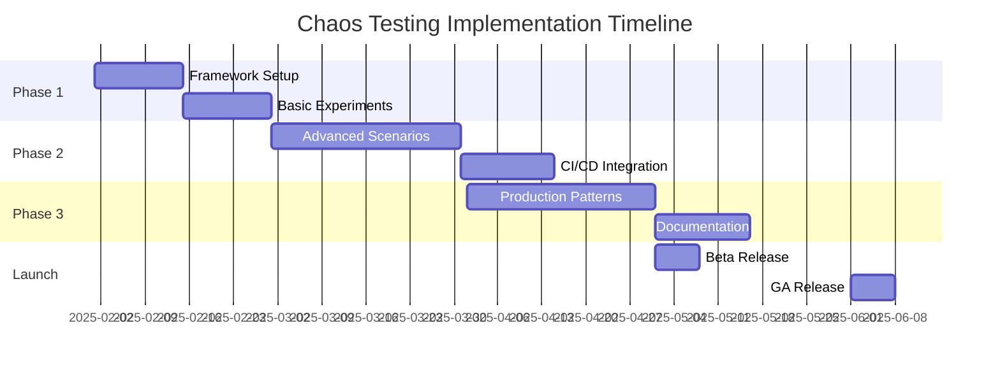

# Chaos Testing Framework for CloudNativePG
## Technical Design Proposal

**Author:** Senior Software Engineer  
**Date:** January 2025  
**Status:** Draft  
**Target Release:** TBD  

## Executive Summary

This proposal outlines the design and implementation strategy for introducing a comprehensive chaos testing framework to CloudNativePG. The framework will systematically validate the operator's resilience, fault tolerance, and recovery mechanisms through controlled failure injection, addressing a critical gap in our current testing strategy.

## Problem Statement

### Current State
CloudNativePG's testing infrastructure comprises:
- **Unit Tests:** Component-level validation with ~80% code coverage
- **E2E Tests:** Feature-complete integration tests including basic failure scenarios
- **Manual Testing:** Ad-hoc validation during development

### Gap Analysis
Our current testing approach lacks:
1. **Systematic Chaos Engineering:** No framework for random, unexpected failure injection
2. **Production-Like Failure Scenarios:** Limited coverage of complex, cascading failures
3. **Resilience Metrics:** Absence of quantitative measurements for recovery capabilities
4. **Continuous Validation:** No automated chaos experiments in CI/CD pipeline

### Business Impact
Without chaos testing, we risk:
- Undetected failure modes reaching production
- Prolonged recovery times during actual incidents
- Reduced operator confidence in high-stakes environments
- Compliance challenges for enterprise deployments

## Technical Architecture

### Framework Selection

After evaluating multiple options, I recommend **Chaos Mesh** as our primary framework:

| Framework | Pros | Cons | Score |
|-----------|------|------|-------|
| **Chaos Mesh** | - Native Kubernetes CRDs<br>- Rich experiment types<br>- Built-in observability<br>- Active CNCF project<br>- Aligns with CNPG's CRD approach | - Steeper learning curve<br>- Resource overhead | **9/10** |
| LitmusChaos | - Large experiment library<br>- Good documentation<br>- CI/CD integration | - Complex architecture<br>- Performance overhead | 7/10 |
| Kraken | - Simple configuration<br>- Low overhead | - Limited Kubernetes support<br>- Fewer experiment types | 5/10 |

**Rationale:** Chaos Mesh's native Kubernetes integration aligns with CloudNativePG's existing architecture using CRDs (Cluster, Backup, ScheduledBackup, Pooler). It can leverage our existing testing utilities in `tests/utils/`.

### Architecture Design

```
┌─────────────────────────────────────────────────────────┐
│                    CI/CD Pipeline                       │
├─────────────────────────────────────────────────────────┤
│                                                         │
│  ┌──────────────┐  ┌──────────────┐  ┌──────────────┐ │
│  │   Unit Tests │→ │   E2E Tests  │→ │ Chaos Tests  │ │
│  └──────────────┘  └──────────────┘  └──────────────┘ │
│                                           │            │
└───────────────────────────────────────────┼────────────┘
                                            │
                    ┌───────────────────────▼────────────┐
                    │     Chaos Testing Framework        │
                    ├─────────────────────────────────────┤
                    │  ┌────────────────────────────┐   │
                    │  │   Chaos Mesh Operator     │   │
                    │  └────────────────────────────┘   │
                    │            │                      │
                    │  ┌─────────▼──────────┐          │
                    │  │  Experiment Engine  │          │
                    │  └─────────┬──────────┘          │
                    │            │                      │
                    │  ┌─────────▼──────────────────┐  │
                    │  │     Target Selectors       │  │
                    │  │  - Pods                    │  │
                    │  │  - Nodes                   │  │
                    │  │  - Network                 │  │
                    │  │  - Storage                 │  │
                    │  └────────────────────────────┘  │
                    └────────────────────────────────────┘
                                 │
                    ┌────────────▼────────────┐
                    │   CloudNativePG Cluster  │
                    ├──────────────────────────┤
                    │  Primary │ Replica │ ... │
                    └──────────────────────────┘
                                 │
                    ┌────────────▼────────────┐
                    │   Observability Stack    │
                    ├──────────────────────────┤
                    │  Prometheus │ Grafana    │
                    │  OpenTelemetry │ Logs    │
                    └──────────────────────────┘
```

### Experiment Categories

#### Phase 1: Foundation (Months 1-2)
1. **Pod Failures**
   - Random pod deletion (primary/replica)
   - Container crashes
   - Resource exhaustion (CPU/Memory)
   
2. **Network Chaos**
   - Partition between primary and replicas
   - Latency injection (10ms-1000ms)
   - Packet loss (1%-50%)

3. **Storage Failures**
   - PVC detachment
   - I/O delays
   - Disk pressure simulation

#### Phase 2: Advanced (Months 3-4)
1. **Cascading Failures**
   - Simultaneous multi-node failures
   - Zone-wide outages
   - Control plane disruptions

2. **Resource Stress**
   - Connection pool exhaustion
   - Transaction lock contention
   - WAL segment accumulation

3. **Operator Failures**
   - Controller restarts
   - Webhook failures
   - CRD validation errors

#### Phase 3: Production Scenarios (Months 5-6)
1. **Real-World Patterns**
   - Black Friday load patterns
   - Gradual performance degradation
   - Byzantine failures

2. **Security Chaos**
   - Certificate rotation during load
   - RBAC permission changes
   - Secret rotation

## Implementation Plan

### Integration with Existing Test Framework

The chaos testing framework will be implemented as an extension of the existing E2E test suite:
- Leverage existing utilities in `tests/utils/` (clusterutils, pods, exec, etc.)
- Follow the Ginkgo/Gomega patterns used in current E2E tests
- Reuse environment setup from `tests/e2e/suite_test.go`
- Extend existing failure scenarios (failover_test.go, fastfailover_test.go)

## Implementation Plan

### Milestone 1: Infrastructure Setup (Week 1-2)
```yaml
deliverables:
  - tests/chaos/deployment/chaos-mesh.yaml
  - tests/chaos/experiments/
  - tests/chaos/utils/
  - docs/src/chaos-testing.md
```

**Tasks:**
- Deploy Chaos Mesh in dedicated namespace using existing `tests/utils/namespaces` utilities
- Configure RBAC aligned with existing operator permissions
- Extend existing monitoring (as seen in `tests/e2e/metrics_test.go`)
- Create experiment templates leveraging `tests/utils/` framework

### Milestone 2: Basic Experiments (Week 3-4)
```go
// tests/chaos/experiments/pod_chaos.go
package chaos

import (
    "github.com/cloudnative-pg/cloudnative-pg/tests/utils/clusterutils"
    "github.com/cloudnative-pg/cloudnative-pg/tests/utils/exec"
    podutils "github.com/cloudnative-pg/cloudnative-pg/tests/utils/pods"
)

type PodChaosExperiment struct {
    Name      string
    Namespace string
    Target    TargetSelector
    Action    ChaosAction
    Duration  time.Duration
    Metrics   []MetricCollector
}

func (e *PodChaosExperiment) Run(ctx context.Context) (*Result, error) {
    // Pre-flight checks
    if err := e.validateClusterHealth(); err != nil {
        return nil, fmt.Errorf("pre-flight failed: %w", err)
    }
    
    // Start metric collection
    collectors := e.startMetricCollection()
    defer e.stopMetricCollection(collectors)
    
    // Execute chaos
    experiment := e.createChaosResource()
    if err := e.applyChaos(ctx, experiment); err != nil {
        return nil, fmt.Errorf("chaos injection failed: %w", err)
    }
    
    // Wait and observe
    time.Sleep(e.Duration)
    
    // Validate recovery
    if err := e.validateRecovery(); err != nil {
        return nil, fmt.Errorf("recovery validation failed: %w", err)
    }
    
    return e.collectResults(collectors), nil
}
```

### Milestone 3: CI/CD Integration (Week 5-6)
```yaml
# .github/workflows/chaos-tests.yaml
name: chaos-testing
on:
  schedule:
    - cron: '0 2 * * *'  # Daily at 2 AM
  workflow_dispatch:
  pull_request:
    paths:
      - 'tests/chaos/**'

jobs:
  chaos-tests:
    runs-on: ubuntu-24.04
    strategy:
      matrix:
        experiment: [pod-failure, network-partition, storage-chaos]
    steps:
      - uses: actions/checkout@11bd71901bbe5b1630ceea73d27597364c9af683 # v4
      - name: Setup Kind Cluster
        run: hack/setup-cluster.sh create
      - name: Deploy CloudNativePG
        run: make deploy CONTROLLER_IMG=${OPERATOR_IMAGE_NAME}:${IMAGE_TAG}
      - name: Deploy Chaos Mesh
        run: kubectl apply -f tests/chaos/deployment/
      - name: Run Chaos Experiment
        run: |
          cd tests
          go test -v ./chaos/experiments \
            -ginkgo.focus="${{ matrix.experiment }}" \
            -timeout=30m \
            -report=/tmp/chaos-report-${{ matrix.experiment }}.json
      - name: Upload Results
        uses: actions/upload-artifact@v3
        with:
          name: chaos-reports
          path: chaos-report-*.json
```

### Milestone 4: Observability & Metrics (Week 7-8)

**Key Metrics to Track:**
```go
type ResilienceMetrics struct {
    // Recovery Metrics
    TimeToDetection   time.Duration `json:"ttd"`    // Time to detect failure
    TimeToRecovery    time.Duration `json:"ttr"`    // Time to full recovery
    DataLossBytes     int64         `json:"data_loss"`
    
    // Availability Metrics
    DowntimeDuration  time.Duration `json:"downtime"`
    FailedRequests    int64         `json:"failed_requests"`
    SuccessRate       float64       `json:"success_rate"`
    
    // Performance Impact
    LatencyP50        time.Duration `json:"p50_latency"`
    LatencyP99        time.Duration `json:"p99_latency"`
    ThroughputDrop    float64       `json:"throughput_drop"`
    
    // Consistency Metrics
    ReplicationLag    time.Duration `json:"replication_lag"`
    SplitBrainEvents  int           `json:"split_brain"`
    DataInconsistency bool          `json:"data_inconsistent"`
}
```

**Grafana Dashboard Configuration:**
```json
{
  "dashboard": {
    "title": "CloudNativePG Chaos Testing",
    "panels": [
      {
        "title": "Recovery Time Objectives",
        "targets": [
          {
            "expr": "histogram_quantile(0.99, cnpg_chaos_recovery_time_seconds)"
          }
        ]
      },
      {
        "title": "Data Consistency",
        "targets": [
          {
            "expr": "cnpg_chaos_data_inconsistency_total"
          }
        ]
      }
    ]
  }
}
```

## Safety Mechanisms

### Blast Radius Control
```go
// tests/chaos/safety/controller.go
package safety

import (
    apiv1 "github.com/cloudnative-pg/cloudnative-pg/api/v1"
    "github.com/cloudnative-pg/cloudnative-pg/tests/utils/clusterutils"
)

type SafetyController struct {
    MaxFailurePercent   float64
    MinHealthyReplicas  int
    EmergencyStopFile   string
    Environment         *environment.TestingEnvironment

func (s *SafetyController) ShouldAbort(cluster *cnpgv1.Cluster) bool {
    // Check cluster health
    if cluster.Status.ReadyInstances < s.MinHealthyReplicas {
        s.triggerEmergencyStop("Insufficient healthy replicas")
        return true
    }
    
    // Check data consistency
    if s.detectDataInconsistency(cluster) {
        s.triggerEmergencyStop("Data inconsistency detected")
        return true
    }
    
    // Check for emergency stop signal
    if _, err := os.Stat(s.EmergencyStopFile); err == nil {
        return true
    }
    
    return false
}
```

### Rollback Procedures
1. **Automatic Rollback:** Experiments auto-terminate after defined duration
2. **Manual Override:** `kubectl delete chaosengine --all`
3. **Circuit Breaker:** Automatic abort on critical metric breach
4. **State Snapshots:** Pre-experiment backup for quick restoration

## Success Criteria

### Quantitative Metrics
- **Recovery Time:** 99% of failures recovered within 5 minutes
- **Data Integrity:** Zero data loss in 100% of experiments
- **Availability:** Maintain 99.9% availability during chaos
- **Test Coverage:** 50+ unique failure scenarios validated

### Qualitative Goals
- **Developer Confidence:** Team comfortable running chaos in staging
- **Documentation Quality:** New contributors can add experiments independently
- **Community Adoption:** 3+ external contributors to chaos tests

## Risk Assessment

| Risk | Probability | Impact | Mitigation |
|------|------------|--------|------------|
| Data corruption during tests | Low | High | Isolated test namespaces, automatic backups |
| CI/CD pipeline delays | Medium | Medium | Parallel execution, optional chaos stage |
| Resource overhead | Medium | Low | Resource quotas, node selectors |
| False positives | High | Low | Baseline establishment, metric tuning |

## Resource Requirements

### Infrastructure
- **Kubernetes Clusters:** 3 dedicated test clusters (small/medium/large)
- **Compute:** Additional 8 vCPUs, 32GB RAM for chaos components
- **Storage:** 100GB for metrics and experiment logs
- **CI/CD:** 2 hours additional daily pipeline time

### Personnel
- **Lead Engineer:** 0.5 FTE for 6 months
- **Mentee (LFX):** 1.0 FTE for 6 months
- **Code Reviews:** 10 hours/month from maintainers

## Timeline



## Open Questions

1. **Scope Boundaries:** Should chaos testing include PostgreSQL extension failures?
2. **Production Testing:** Timeline for introducing GameDays in production?
3. **Multi-Cloud:** Priority order for cloud-specific failure scenarios?
4. **Compliance:** Any regulatory requirements for chaos testing documentation?

## Appendix

### A. Alternative Approaches Considered
- **Build Custom Framework:** Rejected due to maintenance overhead
- **Manual Testing Only:** Insufficient coverage and reproducibility
- **Third-party Services:** Cost and security concerns

### B. Reference Implementations
- [Prometheus Chaos Testing](https://github.com/prometheus/prometheus/tree/main/test/chaos)
- [etcd Failure Injection](https://github.com/etcd-io/etcd/tree/main/tests/failures)
- [Vitess Resilience Tests](https://github.com/vitessio/vitess/tree/main/test/resilience)

### C. Experiment Template
```yaml
apiVersion: chaos-mesh.org/v1alpha1
kind: PodChaos
metadata:
  name: cnpg-primary-failure
  namespace: chaos-testing
spec:
  action: pod-kill
  mode: one
  selector:
    namespaces:
      - cnpg-test
    labelSelectors:
      cnpg.io/cluster: test-cluster
      cnpg.io/instanceRole: primary
  duration: "60s"
  scheduler:
    cron: "@every 2h"
```

## Conclusion

Implementing a comprehensive chaos testing framework represents a critical evolution in CloudNativePG's quality assurance strategy. This proposal provides a pragmatic, phased approach that balances thoroughness with safety, ensuring we can validate our operator's resilience without compromising stability. The investment in chaos engineering will yield significant returns in operator reliability, user confidence, and production readiness.

## Sign-off

**Technical Lead:** _________________  
**Project Maintainer:** _________________  
**LFX Mentor:** _________________  
**Date:** _________________